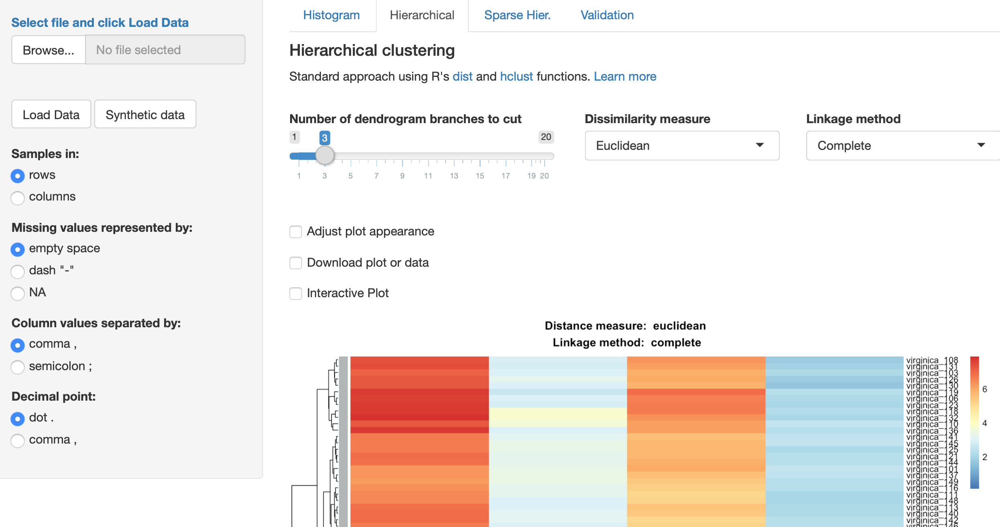

# FreeClust: clustering made easy

An open source web-app for easy interactive clustering and cluster validation. Choose from several clustering algortihms, play with parameters and plot results in a fully interactive fashion. Clustering algortihms include: classical hierarchical clustering, and sparse hierarchical clustering to cluster high-dimensional data (with many more variables than samples). Validation module allows to estimate the optimal number of clusters and to assess the quality of performed clustering.

Access the running instance of the web-app [here](https://macdobry.shinyapps.io/free-clust/).

FreeClust was published in [Analytical Chemistry](https://pubs.acs.org/doi/abs/10.1021/acs.analchem.7b02221).



## Getting started

### Run locally

#### Prerequisites

The app works on all major OS (Windows, macOS, standard Linux distributions) and requires a recent R installation. The R installation guide can be found on the official [website](https://www.r-project.org/).

The app depends on several packages which should be automatically installed when the app is launched for the first time:

- magrittr (provides %>% operator)
- shiny
- shinyBS
- shinycssloaders
- data.table (for fast data processing)
- pheatmap (provides a static heatmap plot)
- heatmaply (provides an interactive heatmap)
- ggplot2 (for plotting in the cluster validation module)
- RColorBrewer (provides `brewer.pal`)
- sparcl (provides sparse hierarchical and k-means clustering)
- dtw (provides Dynamic Time Warping)
- factoextra (provides cluster validation)

The complete list of dependencies can also be manually installed from the R console by typing:
```
install.packages(c("shiny", "shinyBS", "shinycssloaders",
                  "data.table",
                  "ggplot2", 
                  "pheatmap", "heatmaply",
                  "RColorBrewer", "ggthemes",
                  "sparcl", "dtw", "factoextra")) 
```

For new R users, once you have installed R, we recommend to use R from Rstudio. It provides an excellent programming interface and makes it slightly easier to run shiny apps with a single click! Instructions for installation can be found on the Rstudio [website](https://rstudio.com/ "External link").
After downloading the source code, open `server.R` or `ui.R` and click `Run App` button in the upper right corner of the window with the code. All missing packages should be downloaded and installed automatically during the first run of the app.

#### Install and run
First, download the latest version of the app directly from the [GitHub repository](https://github.com/dmattek/shiny-freeclust)(green button *Clone or download*, download as zip). Unzip the folder and place it in your favorite location. 

If you have installed RStudio, launch it and go to *File -> Open Project*. Navigate to the location where you placed the app and open the file `freeclust.Rproj`. This will load the app in the current Rstudio session. To start the app, open the `server.R` or the `ui.R` file in the Rstudio session, then click the *Run App* button with a green triangle in the upper right corner of the window with code open.

If you have R but did not (or do not want to) install Rstudio, you can also start the app directly from your OS's command line with:

```
R -e "shiny::runApp('path-to-application-folder')"
```

Then, open your web browser and point to the address given by the output of that command.

### Run from GitHub
If you already have an R installation with all the packages you can also run the following lines in your R console to start immediatly with a temporary copy of the app:

```
library(shiny)
runGitHub("dmattek/shiny-freeclust")
```

However, for performance reasons you might prefer to switch to an offline installation as outlined above!

### Run on a server
To deploy the app on RStudio/Shiny server, follow the instructions [here](https://shiny.rstudio.com/deploy/ "External link: shiny hosting").

## About

The web-app integrates several clustering algorithms. These include a widely-used [hierarchical clustering](https://en.wikipedia.org/wiki/Hierarchical_clustering) ([hclust](https://stat.ethz.ch/R-manual/R-devel/library/stats/html/hclust.html)) with a choice of commonly used linkage methods to construct the tree diagram (dendrogram). Additionally, sparse hierarchical clustering ([sparcl](https://cran.r-project.org/web/packages/sparcl/)) is tailored to cluster high-dimensional data (with many more variables than samples). The sparse hierarchical provide the information about the **importance** of features/measurements across the samples.

The app allows for rudimentary data manipulation, such as rescaling, removal of missing data, trimming/clipping outliers. The sequence of these operations applied to data is indicated by numbers in brackets in the UI. 

   - First, data can be rescaled with one of the several methods. In case of *z-score*, each measurement (feature) has its mean subtracted and the result is divided by row’s standard deviation. This type of rescaling is recommended if measurements (features) are not is the same units. Calculating the z-score allows to compare such measurements across samples. If data covers several orders of magnitude, consider taking *log10(x)* or *log10(x+1)*. The latter is especially useful if data naturally covers the range *[0, +inf)*. 
   - Second, users can convert missing values to zeroes. In general, it is important to understand the causes of missing data and treat them accordingly. Viable options include omitting such samples entirely or replacing missing data with imputed values, the population mean, etc. 
   - Third, data can be *trimmed* to omit values below and above a threshold. Such data points are turned into missing values, however these are no longer subject to conversion of missing values that can take place in step 2. 
   - Fourth, data clipping can assign threshold values to data exceeding (from below or above) these thresholds. 

### Data format

Users can upload a text file in a wide CSV format: samples and measurements/features should be arranged in columns and rows. The first column and the first row should contain names of samples and/or features, depending on the arrangement. The data can be transposed in the UI. Several example datasets are in the [example-data](example-data) folder.

**Warning!** Depending on regional settings (i.e. *locale*), Excel might save the CSV file differently from the default setting where columns are separated by a comma and dot is used as a decimal separator. For example, a German locale would result in a CSV file with columns separated by a semicolon and decimal point signified by a comma. The app can account for such variations of the input format as well as the convention used to represent missing values, e.g. whether it is a character string “NA”, a dash “-“, or an empty space.